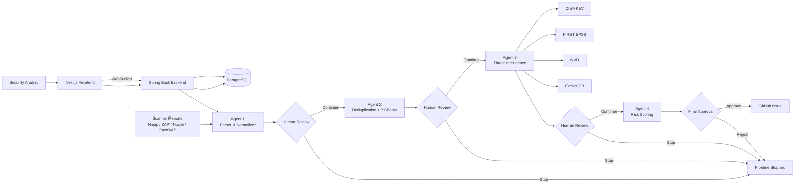

# VertexAI — Risk Prioritization & Deduplication

> A human-supervised cybersecurity platform that transforms noisy vulnerability scanner results into deduplicated, threat-enriched, prioritized remediation findings.

[](https://github.com/aryanosh/VertexAI/actions)
[](LICENSE)

## Overview

VertexAI uses four specialized agents to process findings from Nmap, OWASP ZAP, Nuclei, and OpenVAS:

1. **Agent 1 — Parser & Normalizer**: Converts scanner reports into a common schema.
2. **Agent 2 — Noise Reduction**: Deduplicates findings and uses XGBoost for false-positive classification.
3. **Agent 3 — Threat Intelligence**: Enriches findings using CISA KEV, EPSS, NVD, and Exploit-DB.
4. **Agent 4 — Risk Scoring**: Calculates risk, assigns P0–P3 priority, and prepares remediation tickets.

Every stage includes a Human-in-the-Loop approval checkpoint before the pipeline proceeds.

## Key Features

- Multi-scanner vulnerability ingestion
- Finding deduplication and noise reduction
- XGBoost-based false-positive detection
- CISA KEV and EPSS enrichment
- Explainable risk scoring
- P0–P3 prioritization
- Human approval and stop controls
- GitHub issue generation after final approval
- Next.js security dashboard
- PostgreSQL persistence
- Dockerized deployment

## Architecture



### Runtime Flow

```text
Scanner Reports
      |
      v
+---------------------+
| Agent 1             |
| Parse & Normalize   |
+----------+----------+
           |
           v
     Human Review
           |
           v
+---------------------+
| Agent 2             |
| Dedup + XGBoost     |
+----------+----------+
           |
           v
     Human Review
           |
           v
+---------------------+
| Agent 3             |
| Threat Intelligence |
+----------+----------+
           |
           v
     Human Review
           |
           v
+---------------------+
| Agent 4             |
| Risk + Ticket Prep  |
+----------+----------+
           |
           v
     Final Approval
        +--+--+
        |     |
        v     v
     GitHub  STOP
      Issue  Pipeline
```

## Tech Stack

| Area                | Technology                               |
| ------------------- | ---------------------------------------- |
| Frontend            | Next.js, React, TypeScript, Tailwind CSS |
| Backend             | Java 17, Spring Boot                     |
| AI Agents           | Python 3.11, FastAPI                     |
| ML                  | XGBoost, scikit-learn, pandas            |
| Database            | PostgreSQL                               |
| Threat Intelligence | CISA KEV, FIRST EPSS, NVD, Exploit-DB    |
| Deployment          | Docker, Docker Compose                   |
| Integration         | GitHub REST API                          |

## Repository Structure

```text
VertexAI/
├── agents_service/              # Python AI agents
│   ├── main.py
│   ├── agent1_parser.py
│   ├── agent2_noise.py
│   ├── agent3_threat.py
│   ├── agent4_scoring.py
│   └── verify_pipeline.py
│
├── backend/                     # Spring Boot backend
│   ├── pom.xml
│   └── src/
│
├── frontend/                    # Next.js frontend
│   ├── src/
│   └── package.json
│
├── sample_reports/              # Sample scanner reports
│   ├── nmap_scan.xml
│   ├── nuclei_scan.jsonl
│   ├── openvas_scan.xml
│   └── zap_scan.json
│
├── scripts/
│   └── test_e2e_pipeline.sh     # E2E pipeline verification
│
├── docs/                        # Project documentation
├── docker-compose.yml
├── .env.example
└── LICENSE
```

## Quick Start

### Docker

```bash
git clone https://github.com/aryanosh/VertexAI.git
cd VertexAI

cp .env.example .env

docker-compose up --build
```

### Run Agents Locally

```bash
cd agents_service

python3.11 -m venv .venv
source .venv/bin/activate

pip install -r requirements.txt

uvicorn main:app --reload --port 8000
```

### Run Backend Locally

```bash
cd backend
mvn spring-boot:run
```

### Run Frontend Locally

```bash
cd frontend
npm install
npm run dev
```

## Services

| Service    | Port |
| ---------- | ---: |
| Frontend   | 3000 |
| Backend    | 8080 |
| AI Agents  | 8000 |
| PostgreSQL | 5433 |

## Important Endpoints

### Agent Service

```text
GET  /health
GET  /agent-runtime

POST /api/v1/agent1/parse
POST /api/v1/agent2/reduce-noise
POST /api/v1/agent3/enrich
POST /api/v1/agent4/score-and-ticket
```

API documentation:

```text
http://localhost:8000/docs
```

### Backend

```text
POST /api/auth/login

GET  /api/assets
POST /api/assets

POST /api/scans
GET  /api/scans/{id}
GET  /api/scans/latest
POST /api/scans/{id}/control
POST /api/scans/upload

GET  /api/vulnerabilities
POST /api/vulnerabilities/{id}/ticket

GET  /api/dashboard
```

## Environment Variables

Copy `.env.example` to `.env` and configure the required values.

Important variables include:

```text
POSTGRES_PASSWORD
JWT_SECRET
GITHUB_TOKEN
GITHUB_REPO_OWNER
GITHUB_REPO_NAME

USE_MOCKS
LLM_ENABLED
NVIDIA_API_KEY
NVIDIA_MODEL
```

Never commit `.env` or production credentials.

## Verification

### Agent Pipeline

```bash
cd agents_service
python verify_pipeline.py
```

### Full E2E Pipeline

```bash
bash scripts/test_e2e_pipeline.sh
```

Dry run:

```bash
E2E_DRY_RUN=true bash scripts/test_e2e_pipeline.sh
```

## CI

GitHub Actions configuration:

```text
.github/workflows/ci-cd.yml
```

The CI pipeline performs:

* Java/Maven compilation and tests
* Python validation and tests
* Next.js build
* Trivy security scanning
* Dependency checks
* Docker Compose validation

## Security

VertexAI is designed around Human-in-the-Loop security controls.

* Each agent stage requires human approval before continuing.
* `STOP` halts the pipeline.
* GitHub tickets require explicit final approval.
* GitHub credentials are stored through environment variables.
* Agent 3 supports live intelligence and offline mock fixtures.
* Agent execution is bounded by timeout and iteration limits.
* Scanner execution is isolated through the scanner sandbox service.

## Ownership

| Team   | Responsibility                         |
| ------ | -------------------------------------- |
| Team 1 | Backend, database & GitHub integration |
| Team 2 | AI agents & ML                         |
| Team 3 | Frontend                               |
| Team 4 | DevOps, scanners & E2E                 |

## Documentation

* `architecture_plan.md`
* `BACKEND_EXPLAINED.md`
* `docs/`
* `sample_reports/`
* `VertexAI_Project_Presentation_Overview.pdf`

## Try Asking

* How does `agent2_noise.py` perform vulnerability deduplication?
* How does `PipelineOrchestrator.java` enforce Human-in-the-Loop controls?
* How does `GitHubTicketingService.java` create the final GitHub issue?

## License

VertexAI is licensed under the [MIT License](LICENSE).

## Contact

For questions, issues, or contributions, open an issue or pull request in this repository.

**Suggested commit:** `chore: ready-to-commit README`
